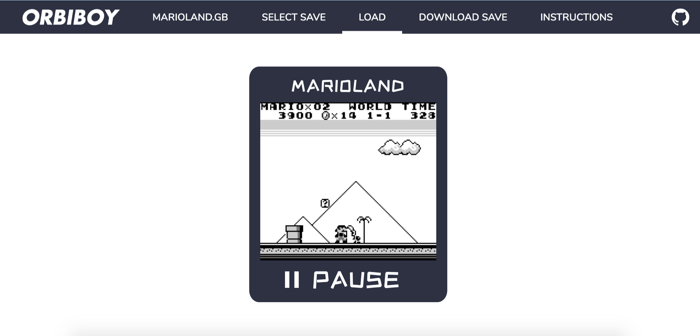

# Orbiboy: A Browser based GameBoy Emulator
Orbiboy is a project about developing a Gameboy emulator that runs on modern web browsers. The emulator is written entirely in C++, and subsequently compiled into [WebAssembly](https://webassembly.org/) via [Emscripten](https://github.com/emscripten-core/emscripten) to be deployed on our website. This project is done together with [tanyyhh](https://github.com/tanyyhh) as part of a school project under National University of Singapore called Orbital.

Check out our [video demo](https://www.youtube.com/watch?v=uQO6GjQrqEI&t=9s).  
[Emulator](https://ybchen97.github.io/orbiboy/).

## How to Use
1. Choose a ROM file by pressing "Select ROM".
2. Press "Load".
3. Enjoy!

## Components
On the emulator side, we have emulated most of the components of the Gameboy architecture as shown below:
- CPU
- Memory Management Unit (including Memory Bank Controllers 1 & 2)
- Graphical Processing Unit
- Timer System
- Interrupt System
- Joypad Controls

Some notable exclusions are the less common Memory Bank Controllers (we have only implemented MBC 1 and 2), the serial port, and sound. The emulator is still buggy, based on testing with Blargg’s test ROMs, a suite of ROMs designed specifically to test Gameboy emulators. We managed to pass 8/11 of the CPU instructions test, but failed the rest of the tests. Nevertheless, our emulator still manages to run simple games such as Tetris and Super Mario Land. 

List of games that run on our emulator:
- Tetris
- Super Mario Land (small bugs)
- Mario & Yoshi
- Klax

For the web app, we have included the following features:
- Uploading of Gameboy ROM files from the user’s local file system
- Saving & loading of the current game state: A snapshot of the current game can be saved, downloaded, and - re-loaded onto the webapp by the user
- Pausing of the game

## Screenshot

## Resources
A few people to thank in the process of making of this emulator:
- [CodeSlinger](http://www.codeslinger.co.uk/pages/projects/gameboy.html) for the awesome tutorial
- [Pandocs](http://gbdev.gg8.se/wiki/articles/Pan_Docs) for many things
- [GameLad](https://github.com/Dooskington/GameLad) for comparing instructions and graphics accuracy
- [Frameboy](https://github.com/CQCumbers/frame_boy) for the web interface
- [Blargg's test ROMs](https://github.com/retrio/gb-test-roms) for debugging
- [Awesome Game Boy Developemnt](https://github.com/gbdev/awesome-gbdev) for the curated list of resources provided
