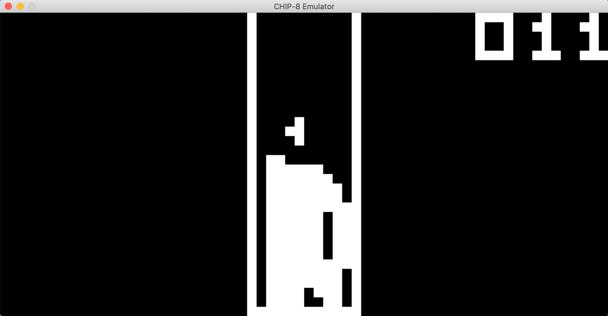
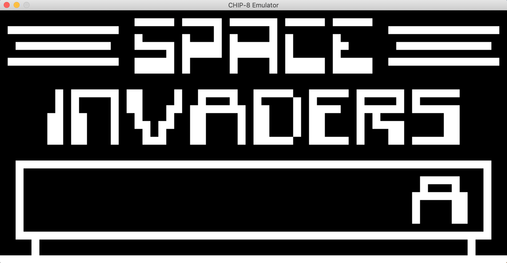
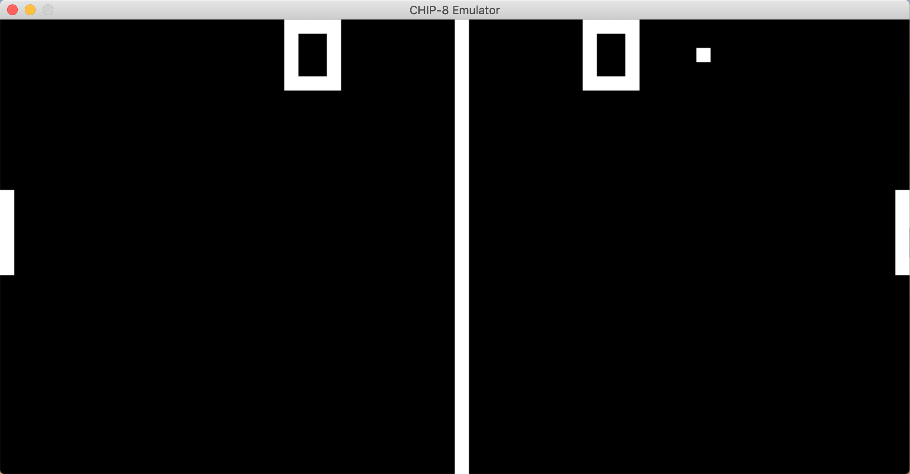
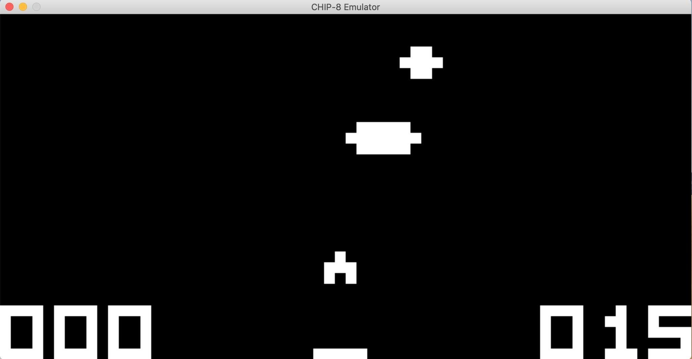

# Chip8 Emulator

A simple Chip8 Emulator that runs Chip8 games such as Invaders, Tetris, Pong etc on your computer. Written in C++, as a primer to prep us for developing a Gameboy Emulator.

Tetris                    | Space Invaders
:------------------------:|:-----------------------------------:
|
Pong                      | UFO
    |

## How to run
Requires SDL2 and C++ compiler
```
$ brew install SDL2
```

I'm currently using clang from Apple LLVM, so:
```
$ clang++ chip8/Main.cpp -o chip8/runGame -lSDL2
$ chip8/runGame <romfile name>
```

Public domain roms can be downloaded online and placed in the `roms` directory to run games. It is currently empty.

## Credits
These amazing dudes with their awesome guides on how to write a chip8 emulator

- [Codeslinger](http://www.codeslinger.co.uk/pages/projects/chip8.html)
- [Laurence Muller](http://www.multigesture.net/articles/how-to-write-an-emulator-chip-8-interpreter/)

### Other References
- [Chip8 wiki page](https://en.wikipedia.org/wiki/CHIP-8)
- [James Griffin](https://github.com/JamesGriffin/CHIP-8-Emulator)